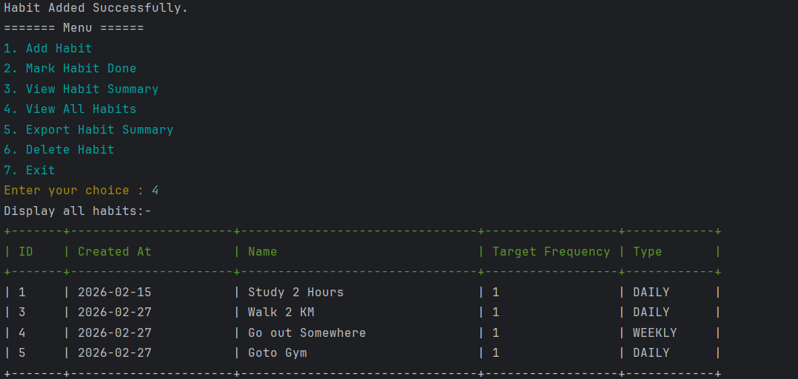
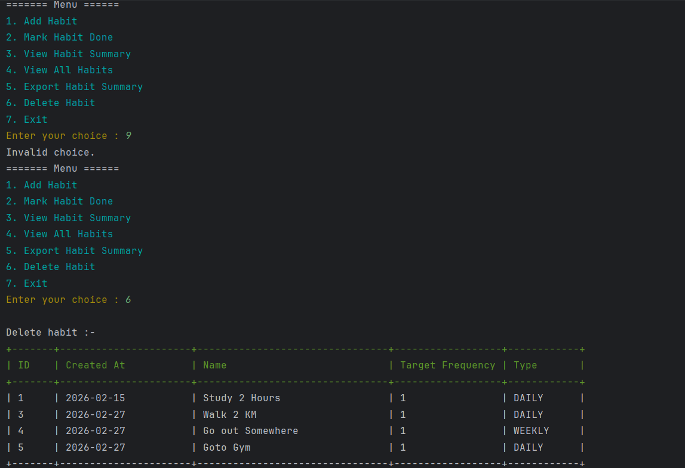
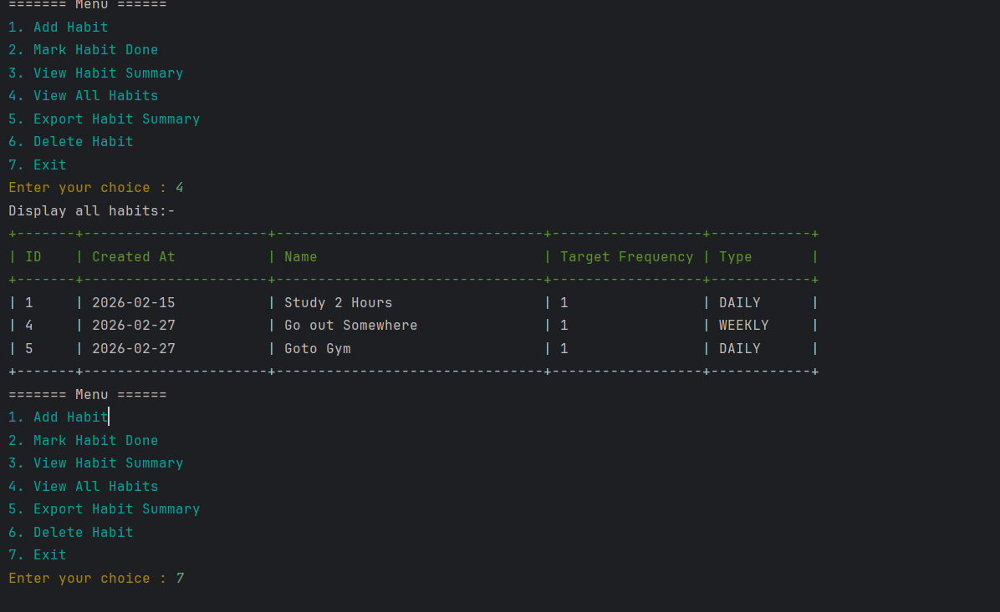
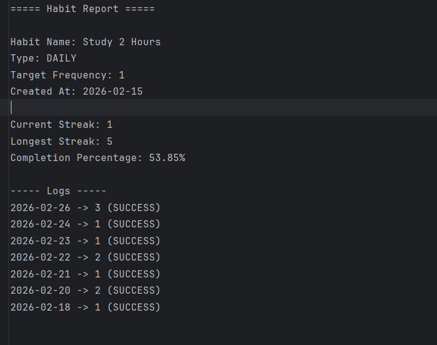

# Habit Tracker (Java + Hibernate)

A frequency-aware habit tracking system built using Java and Hibernate ORM.

## 🚀 Features

- Add and delete habits
- Daily & Weekly habit support
- Frequency-based completion tracking
- Current streak & longest streak calculation
- ISO week-based weekly streak logic
- Completion percentage calculation
- Export habit report to file
- Layered architecture (Controller → Service → DAO)

## 🛠 Tech Stack

- Java
- Hibernate (ORM)
- MySQL / H2 (whichever you're using)
- Console-based UI

## 📊 Core Concepts Implemented

- ChronoUnit-based date calculations
- ISO WeekFields for weekly grouping
- Map-based aggregation using `merge()` and `Integer::sum`
- Exception handling and input validation
- Clean separation of concerns

## 📁 Project Structure

```
entity/
dao/
service/
controller/
util/
```

## 🧠 Future Improvements

- REST API version
- GUI version
- Authentication support
- Analytics dashboard

## 📸 Sample Output






Built as a structured backend project to practice clean architecture and time-based logic handling.